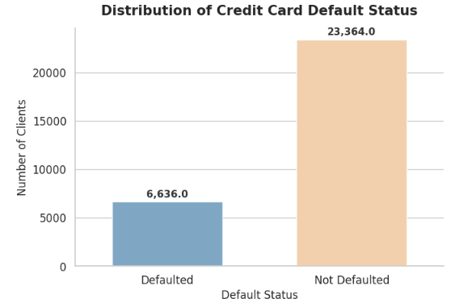
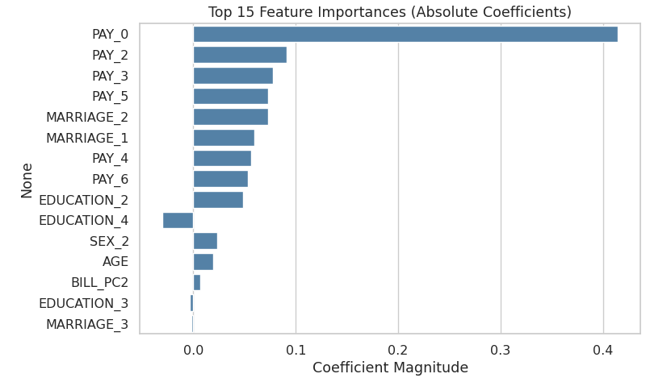
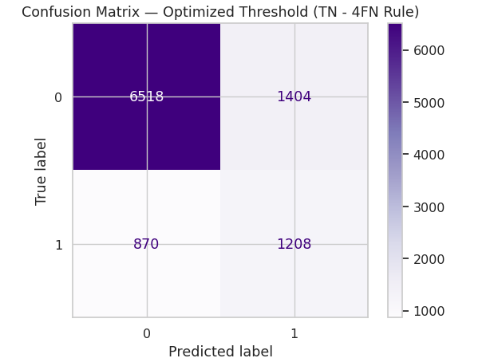

# Credit Default Risk Modeling

This project presents an **end-to-end credit default risk analysis and modeling pipeline**, focusing on understanding borrower behavior, handling real-world data challenges, and building an interpretable classification model for default prediction.

The workflow emphasizes **data quality, feature engineering, statistical diagnostics, and business-aware model evaluation**, rather than black-box performance alone.

---

## Project Overview

The goal of this project is to model the probability that a credit card client will default in the next period.  
The analysis proceeds through:

- Careful exploratory data analysis (EDA)
- Treatment of categorical and numerical variables
- Skewness and outlier diagnostics
- Feature transformation and dimensionality reduction
- Regularized logistic regression
- Business-driven threshold optimization

The project is designed to mirror how **credit risk models are developed and stress-tested in practice**.

---

## Dataset

- Credit card client default dataset (well-known benchmark dataset)
- Binary target variable:
  - `1` = Default
  - `0` = Not Default
- Strong class imbalance, reflecting real credit portfolios

---

## Exploratory Data Analysis

### Target Distribution

The default variable is highly imbalanced, with non-default clients forming the majority.  
This motivates later use of **class-weighted models** and **custom threshold optimization**.

---

### Utilities and Numerical Distributions

Numerical variables such as credit limits, bill amounts, and payment amounts exhibit:

- Heavy right skewness
- Large dispersion
- Meaningful extreme values

These properties make naive scaling insufficient.

---

### Variable Descriptions

All variables are carefully mapped from coded values to interpretable meanings, preserving ordinal structure where appropriate (e.g., repayment delay severity).

---

## Feature Engineering and Transformation

### Outliers as Signal (Not Noise)

Outliers are identified using the **1.5×IQR rule**.  
Rather than removing them, the analysis shows that outlier observations are **systematically associated with higher default risk**, making them economically meaningful.

---

### Transformation Strategy

Two approaches are compared:

- **Min–Max scaling only**
- **Yeo–Johnson transformation + Min–Max scaling**

The combined Yeo–Johnson + Min–Max approach:
- Reduces skewness
- Preserves order
- Retains informative outliers

---

## Correlation and Multicollinearity

Highly correlated billing variables inflate variance and weaken interpretability.

A correlation heatmap is used to diagnose multicollinearity before dimensionality reduction.

---

## Dimensionality Reduction

Two strategies are evaluated for highly correlated bill amount variables:

- Simple averaging
- Principal Component Analysis (PCA)

PCA achieves:
- Lower VIF values
- Slightly better predictive performance
- More stable coefficient estimates

---

## Model Construction

### Base Model

- Logistic Regression
- Elastic Net regularization
- Class-weight = balanced
- PCA-transformed billing features

---

### Model Performance Comparison

Different feature constructions are compared on accuracy and AUC.

---

## Model Interpretation

### Feature Importance

Model coefficients confirm strong economic intuition:

- Recent repayment delays (`PAY_0`, `PAY_2`, `PAY_3`) are the dominant drivers
- Demographic variables play a secondary role
- PCA components summarize longer-term billing behavior

---

### Confusion Matrix

The confusion matrix highlights the trade-off between:
- Capturing default events
- Avoiding excessive false positives

---

## Threshold Optimization (Business-Oriented)

Rather than fixing the classification threshold at 0.5, the project explores **custom objective functions**, such as:

- Penalizing false negatives more heavily than false positives
- Optimizing portfolio-level outcomes instead of raw accuracy

This approach reflects **real credit decision-making**, where misclassifying a bad borrower is often more costly than rejecting a good one.

---

## Key Takeaways

- Outliers in financial data often contain **risk-relevant information**
- Transformation choices materially affect stability and interpretability
- PCA is effective for correlated financial variables
- Threshold selection should be aligned with **business costs**, not default metrics

---

## Disclaimer

This project is for **educational and research purposes only**.

- Results depend on historical data and modeling assumptions
- Logistic regression is a simplified model of credit behavior
- Outputs should not be interpreted as financial or lending advice

---

## Author

**Ke Zhang**  
Credit Risk Modeling & Applied Financial Analytics
